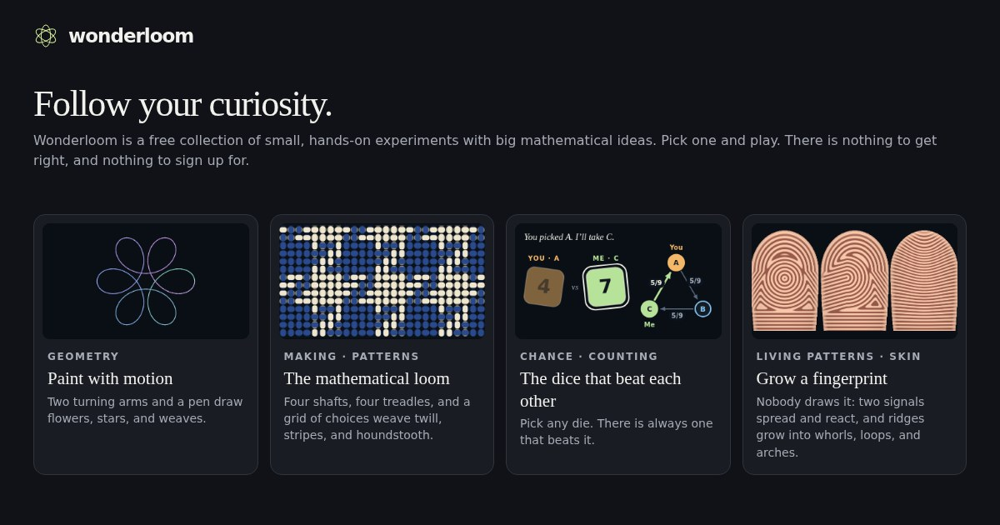

# Wonderlattice

**Small, hands-on experiments with big mathematical ideas. Pick one and play. There is nothing to get right.**

**Play it at [wonderlattice.com](https://wonderlattice.com).**



Wonderlattice is a free collection of thirteen rooms, each built around one surprise:

- **Shape & space:** draw flowers with two turning arms, walk along a ribbon that has only one side, and bend the plane
  until a circle becomes a wing.
- **Chance & evidence:** three dice that beat each other in a circle, and a toy city where a huge poll is confidently
  wrong.
- **Games & puzzles:** Sudoku as colouring a network, and a puzzle cube where two turns, repeated, take 105 rounds to
  come home.
- **Making:** a loom that weaves twill, stripes and houndstooth from a tiny grid of choices.
- **Living patterns:** a flock with no leader, and fingerprints that grow by themselves.
- **Signals & networks:** waves you can hear, a picture sent through a storm of flipped bits, and a new road that slows
  every driver down.

Each room has an optional explanation with sources, and a visiting mathematician. There are no scores, accounts, ads
or tracking. You can keep favourite moments in "My trail", which stays in your own browser.

## Run it yourself

Download or clone this repository and double-click **index.html**. It works offline, in any modern browser, with no
installation or build step.

For a single file you can email or keep, download
[wonderlattice-standalone.html](https://wonderlattice.com/wonderlattice-standalone.html) and open it from your
computer. It holds the whole site, pictures included. (`npm run build` makes the same file in `dist/`.)

## Contribute

Ideas, bug reports, fixes and translations are welcome: see **[CONTRIBUTING.md](CONTRIBUTING.md)**. Adding a language
takes one file and no programming ([docs/TRANSLATING.md](docs/TRANSLATING.md)). To report a security problem, see
[SECURITY.md](SECURITY.md).

For developers, with Node.js 20 or later:

```sh
npm ci           # once: installs the test and formatting tools
npm start        # serves the site at http://localhost:4173
npm run check    # everything CI runs: lint, formatting, translations, tests, build, browser tests
```

The browser tests need a browser: run `npx playwright install chromium` once, or use your own Chrome with
`PW_CHANNEL=chrome npm run check`.

[docs/ARCHITECTURE.md](docs/ARCHITECTURE.md) explains how the pieces fit, with a checklist for adding a room.

## How it was made

Wonderlattice was designed and directed by [Eyal Weiss](https://github.com/eyal-weiss). The code was written with AI
coding assistants, first ChatGPT agents and then Claude Code, and every change was reviewed and tested before it was
merged. [docs/PROVENANCE.md](docs/PROVENANCE.md) has the history, and [AGENTS.md](AGENTS.md) is the brief any coding
assistant should read first.

## Documents

- [docs/ARCHITECTURE.md](docs/ARCHITECTURE.md): structure, the room contract, adding a room
- [docs/TRANSLATING.md](docs/TRANSLATING.md): adding a language
- [docs/PORTRAITS.md](docs/PORTRAITS.md): where the portraits come from, and their rights
- [docs/STATUS.md](docs/STATUS.md): what exists, what's unfinished, what's next
- [docs/COLLABORATING.md](docs/COLLABORATING.md): branches and pull requests, for people and assistants

## Licence

The code and text are under the [MIT licence](LICENSE). The portrait photographs are third-party works with their
own terms, listed in [docs/PORTRAITS.md](docs/PORTRAITS.md).

Contact: Eyal Weiss, [eyal8488@gmail.com](mailto:eyal8488@gmail.com).
