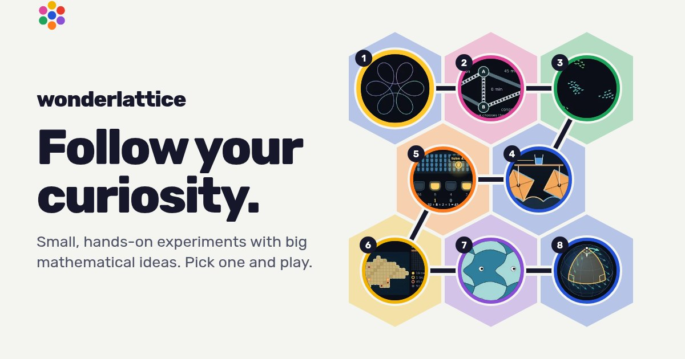

# Wonderlattice

**Small, hands-on experiments with big mathematical ideas. Pick one and play. There is nothing to get right.**

**Play it at [wonderlattice.com](https://wonderlattice.com).**



Wonderlattice is a free collection of thirty-three rooms, each built around one surprise:

- **Shape & space:** draw flowers with two turning arms, walk along a ribbon that has only one side, bend the plane
  until a circle becomes a wing, drag one seed to grow infinite fractal coastlines, play one shot twice on two billiard
  tables, an ellipse that remembers it and a stadium that forgets it within seconds, draw a triangle on a ball
  with three right angles, round which a carried arrow comes home turned, and ride a cart with square wheels
  perfectly level over a road of upside-down hanging chains, or draw any wheel and get its own road.
- **Chance & evidence:** three dice that beat each other in a circle, a toy city where a huge poll is confidently
  wrong, a basketball court where the better shooter loses overall (built by a contributor), and a treasure detector
  that's usually right, yet whose beeps are usually wrong.
- **Games & puzzles:** Sudoku as colouring a network, a puzzle cube where two turns, repeated, take 105 rounds to
  come home, a floor that one glance at the colours proves no dominoes can cover, and 100 cards turned one at a time,
  where just looking at the first 37, then leaping, finds the biggest more than a third of the time.
- **Making:** a loom that weaves twill, stripes and houndstooth from a tiny grid of choices, and an Escher-style tile
  whose edges you bend while it still covers the plane.
- **Engineering:** a shower whose eager bather is scalded, then frozen, by a two-second pipe, a stack of blocks that
  leans as far past the table's edge as you like, a thousand samples in which ten pooled tests, run at once, find
  the one glowing tube, and a hanging chain that, turned upside down, stands as an arch of loose stones, while a
  semicircle of the same stones falls.
- **Living patterns:** a flock with no leader, fireflies that fall into step, fingerprints that grow by themselves,
  waves that curl into spirals, as in a heartbeat, and one cheater among cooperators who grows into an ever-changing
  kaleidoscope where cooperation never dies out.
- **Signals & networks:** waves you can hear, a picture sent through a storm of flipped bits, a new road that slows
  every driver down, a secret agreed out loud, a picture that survives losing most of its numbers, and weather twins
  that drift apart.

The home page is a map: one route through every room, numbered so each stop is unlike the one before, whether you
stay five minutes or an hour. Each room has an optional explanation with sources, and a visiting mathematician. There
are no scores, accounts, ads or tracking. You can keep favourite moments in "My trail", which stays in your own
browser. The sun and moon button switches between day and night colours, the Display button makes the text larger or
raises the contrast, and every explanation ends with a box for sending a message to the maker.

## Run it yourself

Download or clone this repository and double-click **index.html**. It works offline, in any modern browser, with no
installation or build step. (Opened this way, browsers don't load the site's own typefaces, so it uses your
device's; the single file below has them inside.)

For a single file you can email or keep, download
[wonderlattice-standalone.html](https://wonderlattice.com/wonderlattice-standalone.html) and open it from your
computer. It holds the whole site, pictures included. (`npm run build` makes the same file in `dist/`.)

## Contribute

Ideas, bug reports, fixes and translations are welcome: see **[CONTRIBUTING.md](CONTRIBUTING.md)**. Adding a language
takes one folder of small files and no programming ([docs/TRANSLATING.md](docs/TRANSLATING.md)). To report a security problem, see
[SECURITY.md](SECURITY.md).

For developers, with Node.js 20 or later:

```sh
npm ci           # once: installs the test and formatting tools
npm start        # serves the site at http://localhost:4173
npm run check    # everything CI runs: lint, formatting, translations, tests, build, browser tests
```

The browser tests need a browser: run `npx playwright install chromium` once, or use your own Chrome with
`PW_CHANNEL=chrome npm run check`.

[docs/ARCHITECTURE.md](docs/ARCHITECTURE.md) explains how the pieces fit, with a checklist for adding a room.

## How it was made

Wonderlattice was designed and directed by [Eyal Weiss](https://github.com/eyal-weiss). The code was written with AI
coding assistants, first ChatGPT agents and then Claude Code, and every change was reviewed and tested before it was
merged. [docs/PROVENANCE.md](docs/PROVENANCE.md) has the history, and [AGENTS.md](AGENTS.md) is the brief any coding
assistant should read first.

## Documents

- [docs/ARCHITECTURE.md](docs/ARCHITECTURE.md): structure, the room contract, adding a room
- [docs/TRANSLATING.md](docs/TRANSLATING.md): adding a language
- [docs/PORTRAITS.md](docs/PORTRAITS.md): where the portraits come from, and their rights
- [docs/STATUS.md](docs/STATUS.md): what exists, what's unfinished, what's next
- [docs/COLLABORATING.md](docs/COLLABORATING.md): branches and pull requests, for people and assistants

## Licence

The code and text are under the [MIT licence](LICENSE). The portrait photographs are third-party works with their
own terms, listed in [docs/PORTRAITS.md](docs/PORTRAITS.md).

Contact: Eyal Weiss, [eyal8488@gmail.com](mailto:eyal8488@gmail.com).
